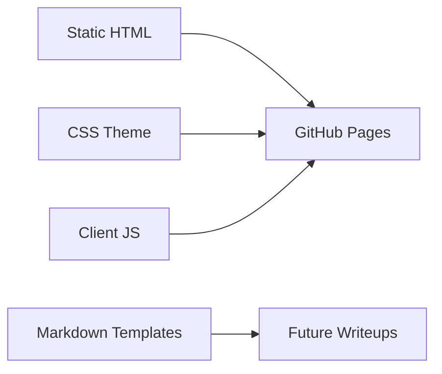

# AhmedQazafy.github.io

Personal website for Ahmed Qazafy Ibrahim, focused on security engineering, SOC work, OT/ICS security, vulnerability research, public projects, and technical writeups.


## Overview

This repository is intentionally small: a static website with no build step and no backend. The goal is to keep the public surface easy to audit, inexpensive to host, and simple to extend.

## Content

| Section | Purpose |
| --- | --- |
| Profile | Security focus, certifications, and operating areas |
| Projects | Public tools and engineering projects |
| Writeups | Research notes and disclosure-safe technical posts |
| Contact | Public professional links |

## Current Project Signals

- `Scrutics` - passive OT/ICS asset discovery and classification.
- `Intelligent Driving System` - embedded driver-state monitoring with computer vision, GPS/GSM response, and Firebase logging.
- `Home Security Lab` - segmented enterprise-style lab using pfSense, Suricata, Active Directory, Kali, vulnerable targets, and Wazuh.
- `OT/ICS Security Lab` - OpenPLC, ScadaBR, Modbus TCP, and passive monitoring concepts.

## Architecture



## File Structure

```text
.
|-- index.html
|-- styles.css
|-- app.js
|-- assets/
|   `-- ahmed-qazafy.jpeg
|-- templates/
|   |-- course-template.md
|   |-- product-template.md
|   `-- writeup-template.md
|-- LICENSE
`-- README.md
```

## Security Boundaries

- The site does not collect payment data.
- The site does not store student records.
- No API keys or secrets belong in this repository.
- Course and product checkout should be handled by an external provider.

## Local Preview

Open `index.html` directly in a browser, or run any static file server from the repository root.

```bash
python -m http.server 8000
```

Then open:

```text
http://localhost:8000
```

## Deployment

This repository is compatible with GitHub Pages. For a user site, publish the `main` branch from the repository root.

## License

The website source code is licensed under the MIT License. Personal branding, written content, course material, writeups, product recommendations, images, logos, and portfolio content remain copyright Ahmed Qazafy Ibrahim unless otherwise stated.
